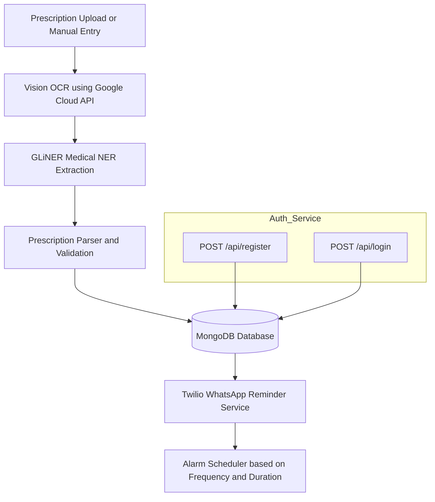

# 🧠 MEDMIRA – Backend
[](https://www.python.org/)
[](https://flask.palletsprojects.com/)
[](https://pypi.org/project/gliner/)\
[](https://www.mongodb.com/)
[](https://cloud.google.com/vision)
[](https://www.twilio.com/)
[](https://www.docker.com/)
[](https://cloud.google.com/run)

**MedMira** is a secure, scalable REST API that powers the patient-care ecosystem.
It extracts data from **prescription images** or **manual text**, performs **OCR + NER** using **Google Vision API** and **GLiNER**, stores structured records in **MongoDB**, and automates **WhatsApp reminders** via **Twilio**.
Fully containerized and deployable on **Google Cloud Run**.

---

## 🚀 Features

* 🔍 **Vision OCR** — extracts raw prescription text using Google Cloud Vision API
* 🧠 **GLiNER Medical NER** — identifies Drug, Strength, Dosage, Frequency, Duration, Doctor, and Patient
* 🗃️ **MongoDB Integration** — stores users, prescriptions, and alarms securely
* 🔐 **Auth System** — lightweight user registration and login
* 💬 **Twilio WhatsApp** — sends automated medicine reminders
* ⏰ **Alarm Scheduler** — triggers reminders based on frequency & duration
* ☁️ **Cloud-Run Ready** — single Dockerfile, environment-variable based configuration

---

## ⚙️ Quick Setup

```bash
# 1️⃣ Clone repo
git clone https://github.com/AKXLR8/Medmira.git
cd Medmira

# 2️⃣ Create and activate virtual environment
python -m venv venv
source venv/bin/activate     # (Windows: venv\Scripts\activate)

# 3️⃣ Install dependencies
pip install -r requirements.txt

# 4️⃣ Start MongoDB (local or Atlas)
docker compose up -d mongo

# 5️⃣ Run the app
python app.py
# App runs on http://0.0.0.0:8080
```

---

## 🧾 Environment Variables (`.env`)

```bash
MONGO_URI="mongodb+srv://<user>:<pass>@cluster.mongodb.net/medmira"
DATABASE_NAME="medmira"
GCLOUD_API_JSON='{"type":"service_account","project_id":"xxx"...}'
TWILIO_SID="ACxxxxxxxxxxxxxxxxxxxxxxxxxxxxxxxx"
TWILIO_TOKEN="xxxxxxxxxxxxxxxxxxxxxxxxxxxxxxxx"
TWILIO_WHATSAPP="+14155238886"
```

---

## 📡 API Endpoints

| Method | Endpoint                   | Description                         |
| ------ | -------------------------- | ----------------------------------- |
| POST   | `/api/register`            | Register new user                   |
| POST   | `/api/login`               | Login and get `user_id` token       |
| POST   | `/api/manual-prescription` | Add prescription manually           |
| POST   | `/api/upload`              | Upload prescription image (no scan) |
| POST   | `/api/scan`                | Upload + extract text + entities    |
| GET    | `/api/prescriptions`       | Get all prescriptions for user      |
| GET    | `/api/history`             | Admin view – all records            |

---

## 🧠 Example Request

### Register

```bash
curl -X POST http://localhost:8080/api/register \
-H "Content-Type: application/json" \
-d '{"name":"Akshay","email":"akshay@medmira.in","password":"1234","guardian_name":"Mom","guardian_whatsapp":"+919999999999"}'
```

### Scan Prescription

```bash
curl -X POST http://localhost:8080/api/scan -F "file=@prescription.jpg"
```

**Response:**

```json
{
  "prescription_id": "64c1f...",
  "raw_text": "Tab Paracetamol 500mg thrice daily",
  "ner": {
    "Drug": "Paracetamol",
    "Strength": "500 mg",
    "Frequency": "8 hourly"
  }
}
```

---

## 🐳 Deploy on Cloud Run

```bash
gcloud builds submit --tag gcr.io/PROJECT/medmira-backend
gcloud run deploy medmira-backend \
  --image gcr.io/PROJECT/medmira-backend \
  --platform managed \
  --region asia-south1 \
  --allow-unauthenticated \
  --set-env-vars "MONGO_URI=...,GCLOUD_API_JSON=...,TWILIO_SID=...,TWILIO_TOKEN=...,TWILIO_WHATSAPP=..."
```

---

## 📂 Folder Structure

```bash
backend/
├── app.py                 # Flask entry point
├── alarm.py               # Twilio WhatsApp reminders
├── auth.py                # /api/register, /api/login
├── Create_PKL.py          # Creates GLiNER model into .PKL 
├── gliner_ner.py          #NER pipeline + fetches the GLiNER_model.pkl
├── vision_client.py       # Google Vision OCR
├── prescription.py        # /api/upload, /api/scan, /api/history
├── manual_prescription.py # Manual entry API
├── models.py              # MongoDB connections & schemas
├── requirements.txt
├── Dockerfile
└── uploads/               # Temporary file storage
```

---

## 🧩 System Architecture



---

## 🧩 Future Enhancements

* 🔐 Add JWT-based authentication
* 🧾 Support for PDF uploads
* 🌍 Multi-language OCR (Hindi, Tamil, etc.)
* ⏰ Intelligent frequency-to-cron parser for reminders
* 💊 FHIR-compliant prescription exports

---


---

Would you like me to include a **badge row for “Build Passing / Deployment Status”** (e.g., from Cloud Build or GitHub Actions) — I can generate Markdown for those next.

**MedMira** is a secure, scalable REST API that powers the patient-care ecosystem.  
It extracts data from **prescription images** or **manual text**, performs **OCR + NER** using **Google Vision API** and **GLiNER**, stores structured records in **MongoDB**, and automates **WhatsApp reminders** via **Twilio**.  
Fully containerized and deployable on **Google Cloud Run**.

---

## 🚀 Features

- 🔍 **Vision OCR** — extracts raw prescription text using Google Cloud Vision API  
- 🧠 **GLiNER Medical NER** — identifies Drug, Strength, Dosage, Frequency, Duration, Doctor, and Patient  
- 🗃️ **MongoDB Integration** — stores users, prescriptions, and alarms securely  
- 🔐 **Auth System** — lightweight user registration and login  
- 💬 **Twilio WhatsApp** — sends automated medicine reminders  
- ⏰ **Alarm Scheduler** — triggers reminders based on frequency & duration  
- ☁️ **Cloud-Run Ready** — single Dockerfile, environment-variable based configuration  

---

## ⚙️ Quick Setup

```bash
# 1️⃣ Clone repo
git clone https://github.com/AKXLR8/Medmira.git
cd Medmira

# 2️⃣ Create and activate virtual environment
python -m venv venv
source venv/bin/activate     # (Windows: venv\Scripts\activate)

# 3️⃣ Install dependencies
pip install -r requirements.txt

# 4️⃣ Start MongoDB (local or Atlas)
docker compose up -d mongo

# 5️⃣ Run the app
python app.py
# App runs on http://0.0.0.0:8080
```

---

## 🧾 Environment Variables (`.env`)

```bash
MONGO_URI="mongodb+srv://<user>:<pass>@cluster.mongodb.net/medmira"
DATABASE_NAME="medmira"
GCLOUD_API_JSON='{"type":"service_account","project_id":"xxx"...}'
TWILIO_SID="ACxxxxxxxxxxxxxxxxxxxxxxxxxxxxxxxx"
TWILIO_TOKEN="xxxxxxxxxxxxxxxxxxxxxxxxxxxxxxxx"
TWILIO_WHATSAPP="+14155238886"
```

---

## 📡 API Endpoints

| Method | Endpoint                   | Description                         |
| ------ | -------------------------- | ----------------------------------- |
| POST   | `/api/register`            | Register new user                   |
| POST   | `/api/login`               | Login and get `user_id` token       |
| POST   | `/api/manual-prescription` | Add prescription manually           |
| POST   | `/api/upload`              | Upload prescription image (no scan) |
| POST   | `/api/scan`                | Upload + extract text + entities    |
| GET    | `/api/prescriptions`       | Get all prescriptions for user      |
| GET    | `/api/history`             | Admin view – all records            |

---

## 🧠 Example Request

### Register

```bash
curl -X POST http://localhost:8080/api/register \
-H "Content-Type: application/json" \
-d '{"name":"Akshay","email":"akshay@medmira.in","password":"1234","guardian_name":"Mom","guardian_whatsapp":"+919999999999"}'
```

### Scan Prescription

```bash
curl -X POST http://localhost:8080/api/scan -F "file=@prescription.jpg"
```

**Response:**

```json
{
  "prescription_id": "64c1f...",
  "raw_text": "Tab Paracetamol 500mg thrice daily",
  "ner": {
    "Drug": "Paracetamol",
    "Strength": "500 mg",
    "Frequency": "8 hourly"
  }
}
```

---

## 🐳 Deploy on Cloud Run

```bash
gcloud builds submit --tag gcr.io/PROJECT/medmira-backend
gcloud run deploy medmira-backend \
  --image gcr.io/PROJECT/medmira-backend \
  --platform managed \
  --region asia-south1 \
  --allow-unauthenticated \
  --set-env-vars "MONGO_URI=...,GCLOUD_API_JSON=...,TWILIO_SID=...,TWILIO_TOKEN=...,TWILIO_WHATSAPP=..."
```

---

## 📂 Folder Structure

```bash
backend/
├── app.py                 # Flask entry point
├── alarm.py               # Twilio WhatsApp reminders
├── auth.py                # /api/register, /api/login
├── gliner_ner.py          # GLiNER model + NER pipeline
├── vision_client.py       # Google Vision OCR
├── prescription.py        # /api/upload, /api/scan, /api/history
├── manual_prescription.py # Manual entry API
├── models.py              # MongoDB connections & schemas
├── requirements.txt
├── Dockerfile
└── uploads/               # Temporary file storage
```

---

## 🧩 System Architecture


---

## 🧩 Future Enhancements

- 🔐 Add JWT-based authentication  
- 🧾 Support for PDF uploads  
- 🌍 Multi-language OCR (Hindi, Tamil, etc.)  
- ⏰ Intelligent frequency-to-cron parser for reminders  
- 💊 FHIR-compliant prescription exports  

---

## 📄 License

**MIT License** — free for hospitals, NGOs, and educational projects.

> Built with ❤️ by the **MedMira Team** — making prescriptions *understandable, searchable, and alarm-friendly.*
